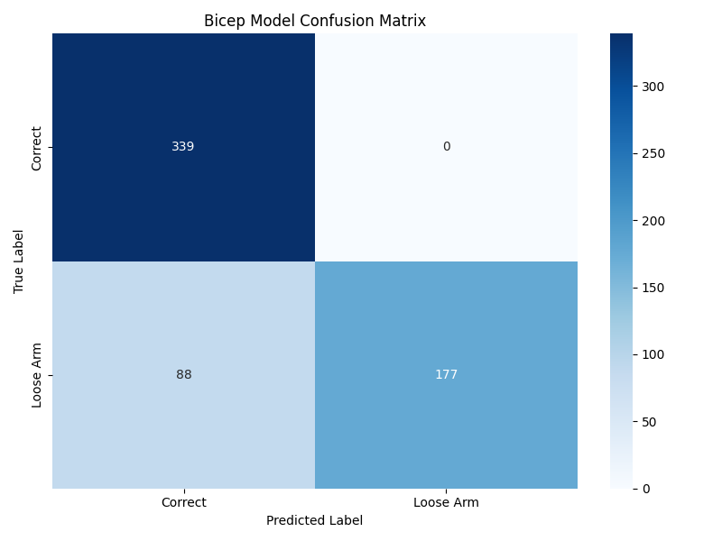
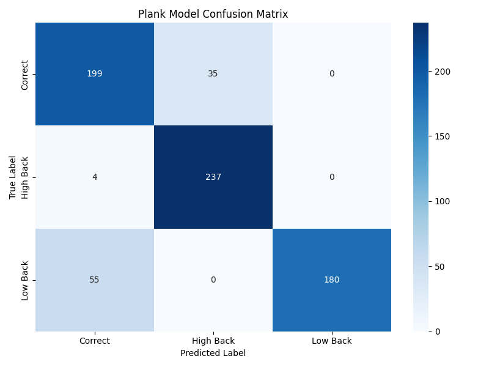
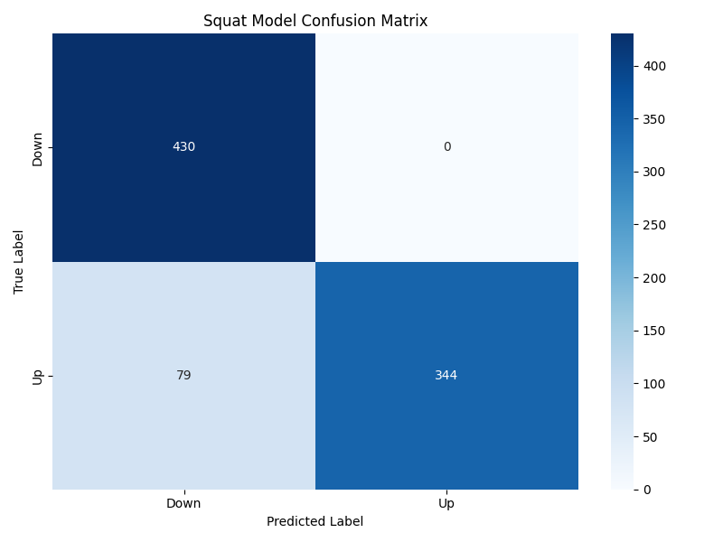
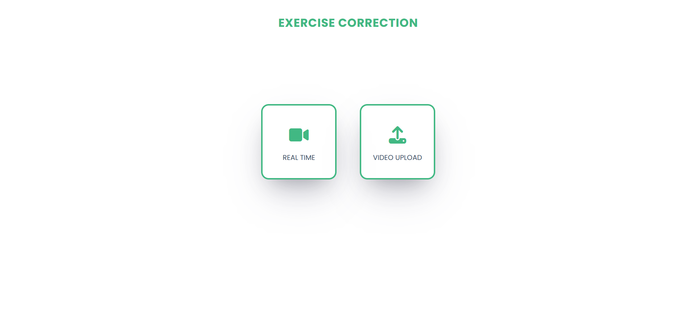
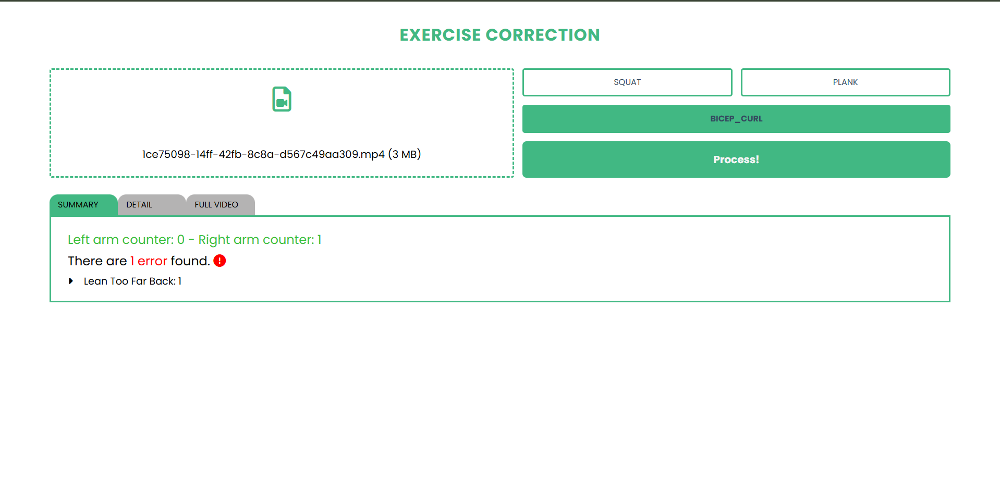
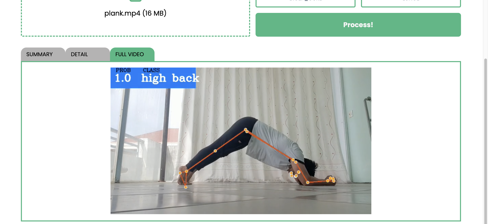

<div id="top"></div>
<br />

  <h1 align="center">Home Workout Pose Analysis and Feedback</h1>

  <p align="center">
    Make use of the power of Mediapipe’s pose detection, this project is built in order to analyze, detect and classifying the forms of fitness exercises.
  </p>
</div>

<!-- ABOUT THE PROJECT -->

## About The Project

An intelligent 2D pose estimation–based injury prevention system for home workouts. This project analyzes joint angles and movement patterns from video input to estimate joint stress, detect improper exercise form, and reduce the risk of musculoskeletal injuries using computer vision and rule-based biomechanical analysis.

Here are some detections of the exercises:

-   Bicep Curl
<p align="center"></p>

-   Basic Plank
<p align="center"></p>

-   Basic Squat
<p align="center"></p>

-   Models' evaluation results and website screenshots [here](#usage)

<p align="right">(<a href="#top">back to top</a>)</p>

### Built With

1. For data processing and model training

    - [Numpy](https://numpy.org/)
    - [Pandas](https://pandas.pydata.org/)
    - [Sklearn](https://scikit-learn.org/stable/)
    - [Keras](https://keras.io/)

1. For building website

    - [Vue.js v3](https://vuejs.org/)
    - [Django](https://www.djangoproject.com/)

<p align="right">(<a href="#top">back to top</a>)</p>

## Dataset

Due to the limited availability of publicly accessible datasets containing exercise videos that capture both correct and incorrect human movements, most of the data used in this project was self-collected. These videos were recorded by the author, as well as by friends and family members. However, a significant portion of this data was later removed to address privacy concerns.

For exercises such as the plank, which involve minimal movement, an existing dataset was identified from an open-source repository on Kaggle. This dataset primarily consists of various yoga poses, including downward dog, goddess, tree, plank, and warrior poses. It is organized into five folders, each containing images of individuals correctly performing the corresponding pose.

For the scope of this work, only the folder containing plank pose images was utilized. The folder originally contained 266 images, from which only those representing a standard basic plank posture were manually selected, while the remaining images were discarded. As a result, a final set of 30 images was curated and labeled as the proper-form class for the basic plank exercise.

## Getting Started

This is an example of how you may give instructions on setting up the project locally.

#### Setting Up Environment

```
    Python 3.8.13
    Node 17.8.0
    NPM 8.5.5
    OS: Linux or MacOS
```

```markdown
    NOTES
    ⚠️ Commands/Scripts for this project are wrote for Linux-based OS. They may not work on Windows machines.
```


1. Folder **_[core](./core/README.md)_** is the code for data processing and model training.
1. Folder **_[web](./web/README.md)_** is the code for website.

<p align="right">(<a href="#top">back to top</a>)</p>

<!-- USAGE EXAMPLES -->
<div id="Usage"></div>
<br/>

## Usage

As the introduction indicated, there are 2 purposes for this project.

1. Model training **(describe in depth [here](core/README.md))**. Below are the evaluation results for each models.

    - [Bicep Curl](core/bicep_model/README.md) - _lean back error_: Confusion Matrix - ROC curve
      |  |  |
      | ------------- | ------------- |
    - [Plank](core/plank_model/README.md) - _all errors_: Confusion Matrix - ROC curve
      |  |  |
      | ------------- | ------------- |
    - [Basic Squat](core/squat_model/README.md) - _stage_: Confusion Matrix - ROC curve
      |  |  |
      | ------------- | ------------- |

1. Website for exercise detection. This web is for demonstration purpose of all the trained models, therefore, at the moment there are only 1 main features: Analyzing and giving feedbacks on user's exercise video.
 <p align="center"></p>
 <p align="center"></p>
 <p align="center"></p>
 <p align="center"></p>

<p align="right">(<a href="#top">back to top</a>)</p>

<!-- LICENSE -->

## License

Distributed under the MIT License.

MIT License

Copyright (c) 2025 Harshit Jasty

Permission is hereby granted, free of charge, to any person obtaining a copy
of this software and associated documentation files (the "Software"), to deal
in the Software without restriction, including without limitation the rights
to use, copy, modify, merge, publish, distribute, sublicense, and/or sell
copies of the Software, and to permit persons to whom the Software is
furnished to do so, subject to the following conditions:

The above copyright notice and this permission notice shall be included in all
copies or substantial portions of the Software.

THE SOFTWARE IS PROVIDED "AS IS", WITHOUT WARRANTY OF ANY KIND, EXPRESS OR
IMPLIED, INCLUDING BUT NOT LIMITED TO THE WARRANTIES OF MERCHANTABILITY,
FITNESS FOR A PARTICULAR PURPOSE AND NONINFRINGEMENT. IN NO EVENT SHALL THE
AUTHORS OR COPYRIGHT HOLDERS BE LIABLE FOR ANY CLAIM, DAMAGES OR OTHER
LIABILITY, WHETHER IN AN ACTION OF CONTRACT, TORT OR OTHERWISE, ARISING FROM,
OUT OF OR IN CONNECTION WITH THE SOFTWARE OR THE USE OR OTHER DEALINGS IN THE
SOFTWARE.

